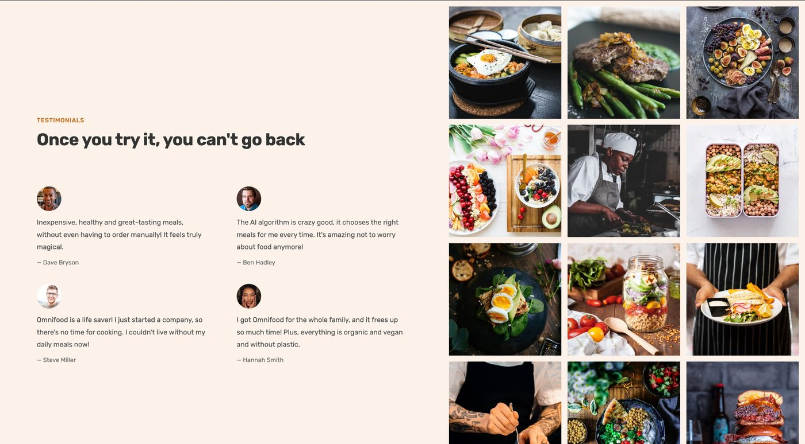
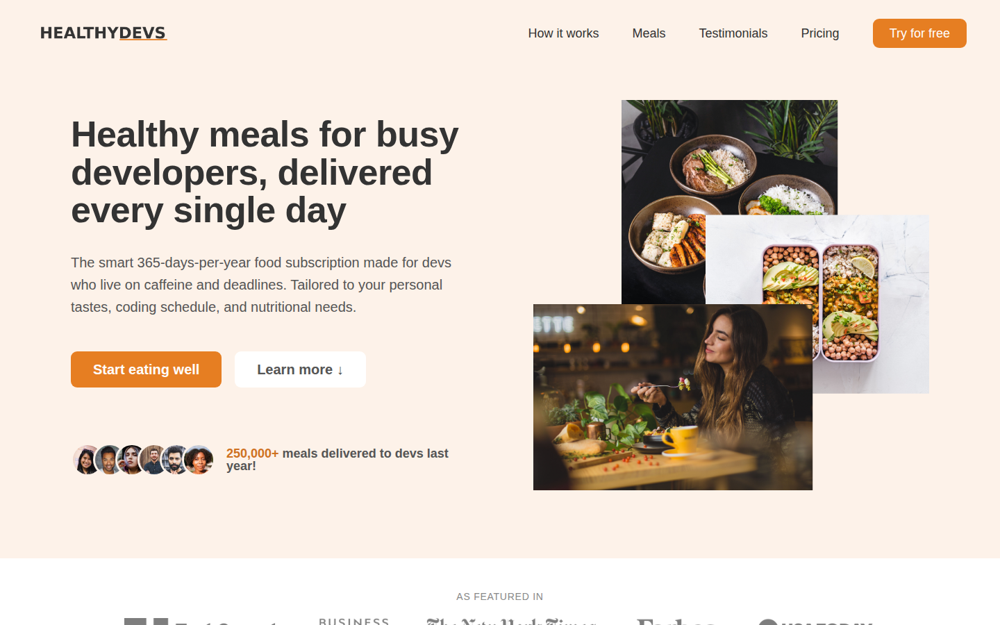
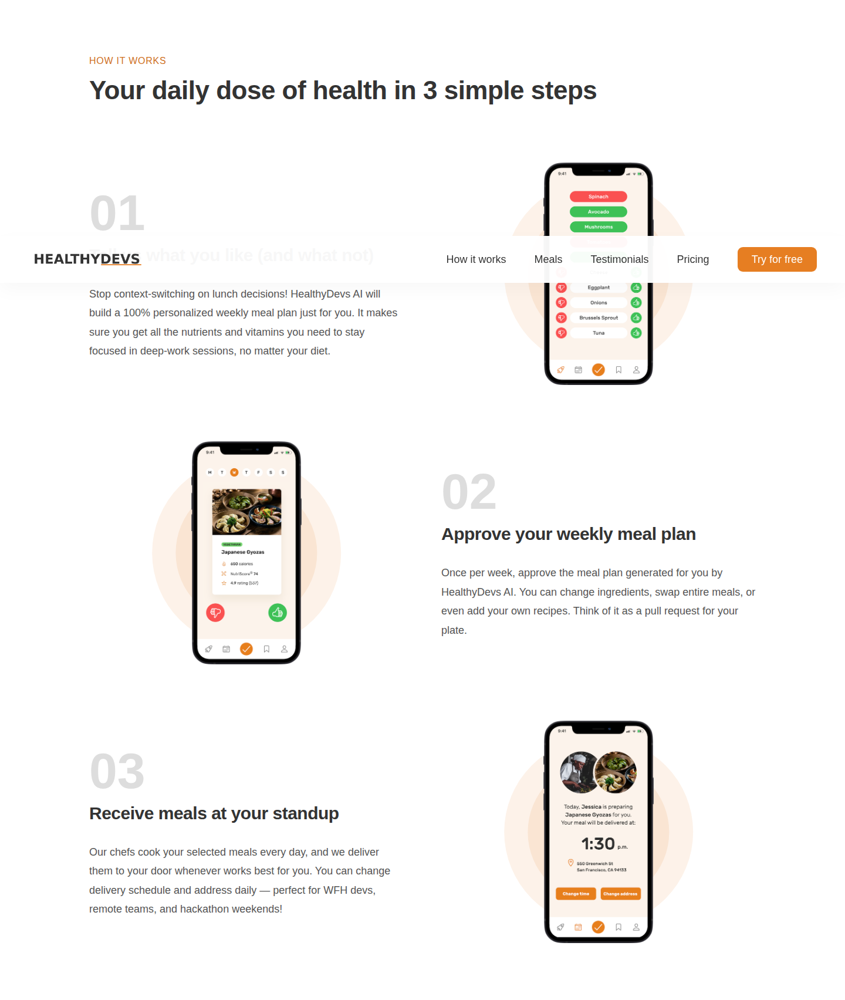
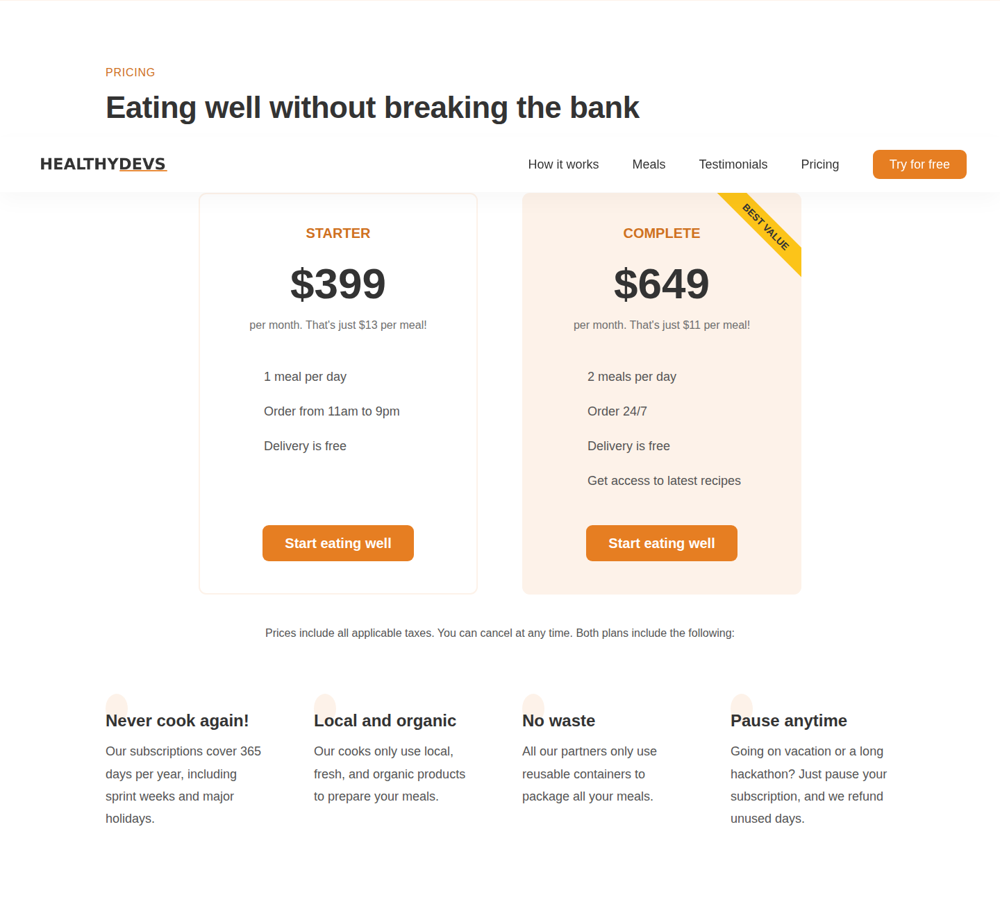

# HealthyDevs 🥗💻

> Fuel your code, not your cravings.



A responsive landing page for **HealthyDevs** — a fictional AI-powered meal subscription service built for busy developers. Skip the decision fatigue, skip the junk food, and get healthy meals delivered to your door 365 days a year.

Built with modern, hand-written **HTML5**, **CSS3**, and **vanilla JavaScript** — no frameworks, no build step, just drop it in a browser and it runs.

---

## 📖 Table of Contents

- [Live Demo](#-live-demo)
- [Screenshots](#-screenshots)
- [About The Project](#-about-the-project)
- [Features](#-features)
- [Tech Stack](#-tech-stack)
- [Project Structure](#-project-structure)
- [Getting Started](#-getting-started)
- [Sections](#-sections)
- [Responsive Design](#-responsive-design)
- [Author](#-author)
- [License](#-license)

---

## 🚀 Live Demo

Open `index.html` in any modern browser, or deploy the folder as-is to Netlify / Vercel / GitHub Pages.

---

## 📸 Screenshots

### Hero section

> *"Healthy meals for busy developers, delivered every single day"*



### How it works

A 3-step walkthrough of the product — from preferences to weekly plan approval to delivery.



### Pricing

Two plans, Starter and Complete, plus four feature highlights below.



---

## 📝 About The Project

HealthyDevs targets a very specific persona: the developer who lives on deadlines, standups, and half-cold coffee. The copy, testimonials, and signup sources (GitHub, Hacker News, Twitter) are all tailored to that audience. The design emphasizes trust, clarity, and zero-friction signup.

Every section tells a small story:

- **Hero** — the promise ("Healthy meals for busy developers, delivered every single day") + social proof ("250,000+ meals delivered to devs last year")
- **How it works** — 3 simple steps that each fit a developer's mental model ("a pull request for your plate")
- **Meals** — sample meal cards with calories, NutriScore, and ratings
- **Testimonials** — quotes from Backend Engineers, DevOps Leads, Engineering Managers
- **Pricing** — two clear tiers with a highlighted "Complete" plan
- **CTA + Footer** — signup form + full footer with navigation, address, and social links

---

## ✨ Features

- 🎯 Pixel-polished responsive layout with CSS Grid + Flexbox
- 📱 Mobile navigation with hamburger toggle
- 🧭 Smooth in-page scrolling with polyfill for older browsers
- 🖼️ 12-image food gallery with CSS hover transforms
- 💳 Side-by-side pricing plan comparison
- 📝 Accessible HTML5 form with proper labels + required fields
- 🎨 Custom color system + reusable utility classes
- 🔄 Sticky header that stays put as you scroll
- 🧪 Zero dependencies beyond two tiny CDN libs (ionicons + smoothscroll-polyfill)

---

## 🧰 Tech Stack

| Layer      | Tool / Approach                                              |
| ---------- | ------------------------------------------------------------ |
| Markup     | Semantic HTML5                                               |
| Styling    | CSS3 — custom properties, Grid, Flexbox, media queries       |
| Scripting  | Vanilla JavaScript (ES6+)                                    |
| Fonts      | Rubik via Google Fonts                                       |
| Icons      | Ionicons (via CDN)                                           |
| Scrolling  | smoothscroll-polyfill                                        |

---

## 📁 Project Structure

```
healthydevs/
├── css/
│   ├── general.css      # Reset + design-system base (colors, spacing, typography)
│   ├── style.css        # Section-specific styles
│   └── queries.css      # Responsive breakpoints
├── js/
│   └── script.js        # Mobile nav toggle, smooth scroll, sticky header, auto year
├── img/
│   ├── app/             # Phone app mockup screens
│   ├── customers/       # Customer / testimonial photos
│   ├── gallery/         # Food photo gallery
│   ├── logos/           # "As featured in" press logos
│   ├── meals/           # Sample meal images
│   ├── healthydevs-logo.png
│   ├── favicon.png
│   ├── hero.png
│   └── eating.jpg
├── index.html
├── preview.jpg             # README preview
├── screenshot-hero.png     # Hero section
├── screenshot-how.png      # How-it-works section
├── screenshot-pricing.png  # Pricing section
└── README.md
```

---

## 🏁 Getting Started

No build step, no install, no tooling. Really.

```bash
git clone https://github.com/merlynfrancis/healthydevs.git
cd healthydevs
```

Then either:

- **Double-click `index.html`** to open in your default browser, or
- Serve the folder with any static server:

  ```bash
  # Python
  python3 -m http.server 8000

  # Node (npx)
  npx serve .

  # VS Code
  # Install "Live Server" extension, right-click index.html → "Open with Live Server"
  ```

Visit `http://localhost:8000` and you're done.

---

## 🧩 Sections

1. **Header** — logo + nav + "Try for free" CTA
2. **Hero** — headline, subtitle, dual CTAs, customer proof
3. **Featured In** — press logos strip
4. **How It Works** — 3-step illustrated walkthrough
5. **Meals** — meal cards + "works with any diet" checklist
6. **Testimonials + Gallery** — 4 quotes beside a 12-image grid
7. **Pricing** — Starter vs. Complete plan + 4 feature highlights
8. **CTA** — signup form with background image
9. **Footer** — logo, address, account / company / resources nav, social links

---

## 📐 Responsive Design

Breakpoints live in `css/queries.css` and cover:

- **≤ 1200px** — tighter padding, scaled-down type
- **≤ 944px** — tablet layout, collapsed navigation
- **≤ 704px** — stacked grids, mobile nav menu
- **≤ 544px** — single-column layout, fluid typography

The mobile navigation uses a CSS-only transform with a JS-driven class toggle for accessibility.

---

## 👤 Author

**Merlyn Francis**

- GitHub: [@merlynfrancis](https://github.com/merlynfrancis)
- Project: [HealthyDevs on GitHub](https://github.com/merlynfrancis/healthydevs)

> 💬 If you build anything on top of this, I'd love to see it — open a PR or drop me an issue.

---

## 📄 License

This project is released under the **MIT License**. See [LICENSE](LICENSE) for details.

Copyright © 2026 Merlyn Francis.

Original landing-page design concept adapted from the Omnifood course project by Jonas Schmedtmann; all copy, branding, and content in this repo have been rewritten for the developer audience.

[⬆ Back to Top](#healthydevs-)
